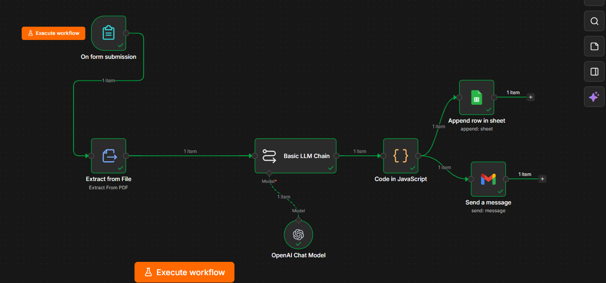
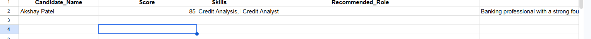
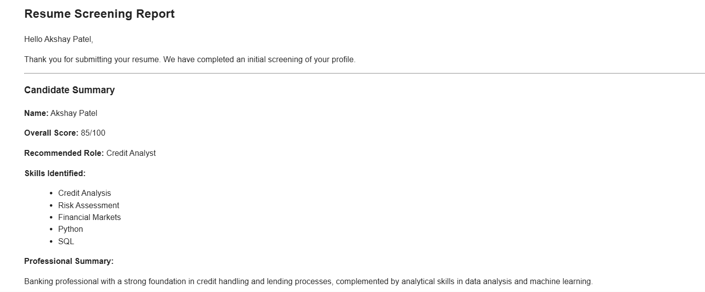

# AI Resume Screening Workflow

An automated resume screening system built using n8n and OpenAI that analyzes uploaded resumes, extracts key candidate information, scores applicants, stores results in Google Sheets, and sends professional screening reports via email.

## Features

- Resume PDF upload through n8n Form
- Automatic text extraction from resumes
- AI-powered candidate analysis using OpenAI
- Candidate scoring and skill extraction
- Recommended role generation
- Structured JSON output
- Google Sheets database integration
- Automated email reports to candidates

## Tech Stack

- n8n
- OpenAI GPT
- Google Sheets API
- Gmail API
- PDF Text Extraction

## Workflow

Resume Upload → PDF Extraction → AI Analysis → JSON Parsing → Google Sheets → Email Report

## Screenshots

### n8n Workflow

### Google Sheets Database

### Email Report

## Business Problem

HR teams spend hours manually reviewing resumes and extracting candidate information.

## Solution

This workflow automatically:
- Extracts resume text from PDF files
- Analyzes candidate qualifications using AI
- Generates structured hiring insights
- Stores candidate data in Google Sheets
- Sends personalized screening reports via email

## Results

- Reduce manual screening time by 80%
- Standardize candidate evaluation
- Create searchable candidate database

Resume Upload
      ↓
PDF Extraction
      ↓
OpenAI Analysis
      ↓
JSON Parser
      ↓
Google Sheets
      ↓
Email Report

## Demo Video

[Watch Demo](https://www.loom.com/share/964bd9ff02d14676a89d1d3aa6a3a7fb)

## Use Cases

- HR Recruitment Automation
- Candidate Screening
- Talent Acquisition
- Resume Ranking
- Applicant Tracking

## Future Enhancements

- PDF Report Generation
- ATS Integration
- Multi-Candidate Ranking Dashboard
- Recruiter Analytics Dashboard
- Candidate Shortlisting Automation
